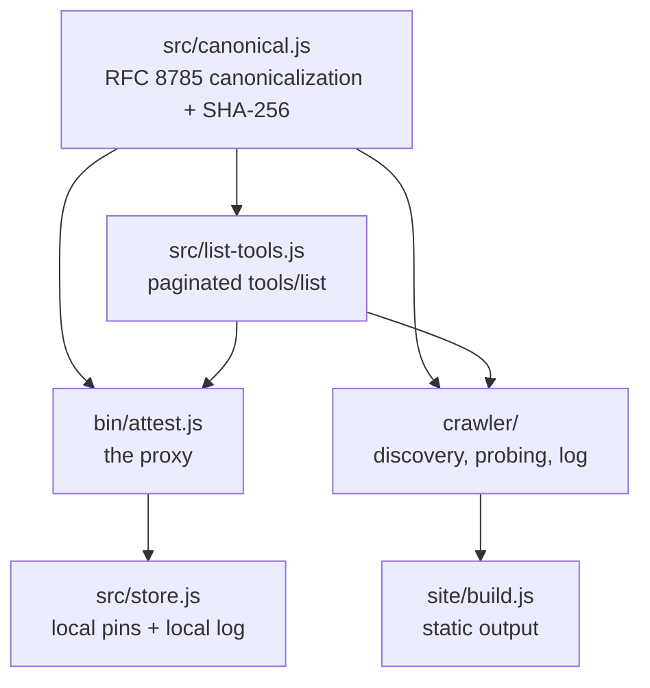
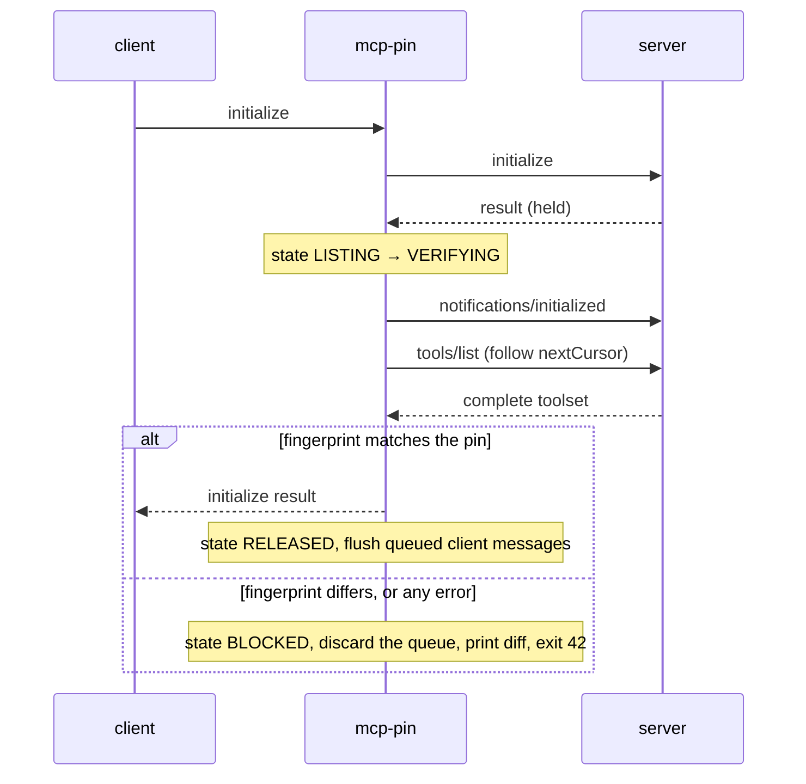

# Architecture

Four moving parts, one shared hashing rule. Everything else follows from that.



If the canonicalization rule were ambiguous, every other component would disagree with itself over time. That is why it is one small file with the most tests.

## src/canonical.js

Turns a tool object into exactly one string, then hashes it.

- Object keys sorted by UTF-16 code unit, per RFC 8785
- No insignificant whitespace
- Arrays keep their order, objects do not depend on it
- `fingerprintTool` hashes one tool; `fingerprintToolset` sorts per tool hashes by name and hashes the concatenation, so additions and removals move the set hash

The set hash exists because a rug pull that *adds* a tool is the same attack as one that mutates a tool. Per tool hashing alone would miss it.

## src/list-tools.js

Shared by the proxy and the crawler. `collectAllTools(sendRequest)` follows `nextCursor` until the cursor is null or empty, rejects a repeated cursor, caps at 50 pages, and returns tools sorted by name. A page that errors or fails to parse throws; a partial toolset is never returned as complete.

## bin/attest.js, the proxy

A stdio shim. Client on one side, server on the other, JSON-RPC lines flowing through.



The proxy issues **its own** `tools/list`, including pagination, and withholds the initialize response from the client until the fingerprint matches. Inbound client messages are queued from the first byte. On match they are flushed in order. On drift they are discarded. Versions ≤0.1.0 forwarded initialize immediately and probed in parallel, which meant a `tools/call` could run before the block.

State lives in `~/.mcp-pin`: `pins.d/<server_id>.json` for current fingerprints (atomic rename, no shared read-modify-write) and `log.ndjson` for a local hash-linked history guarded by an exclusive lock. A legacy `pins.json` is migrated once.

## crawler/

| File | Job |
|---|---|
| `discover.js` | Find servers: npm keyword search, the MCP registry, GitHub topic `mcp-server` |
| `probe.js` | Get a complete `tools/list` over stdio or HTTP, following `nextCursor`, with install, retry, and validation |
| `log.js` | Append only hash linked log with Ed25519 signed heads |
| `badge.js` | Deterministic SVG, pure function so it works in a build or a Worker |
| `security.js` | SSRF guard, byte caps, toolset validation, identifier validation |
| `crawl.js` | Orchestration, opt out, pacing, state |

Two deliberate choices worth explaining.

**Install then run, not `npx`.** `npx` cold resolves on every invocation, which times out under any concurrency. The crawler installs into a scratch prefix with `--ignore-scripts`, reads the manifest, and executes the declared bin directly. Installs are serialized because npm's cache is not safe under heavy parallelism, which cost a full debugging cycle to discover.

**Change log, not heartbeat log.** An entry is appended only when a fingerprint differs from the last recorded one. Liveness lives in `state.json`. A server that never changes has exactly one entry forever, and the log stays small enough to download and verify by hand.

## site/build.js

Reads the log and state, writes static files. No server, no database, no runtime.

```
public/
├── index.html              searchable server list
├── servers/<id>.html       history, rendered diffs, badge snippet
├── badge/<id>.svg          the badge
├── feed/<id>.xml           per server RSS
├── api/servers.json        machine readable index
├── log.ndjson              the full log
├── head.json               the signed head
└── PUBLIC_KEY.txt          the pinned verifier key
```

Everything on these pages is attacker controlled text, so everything is escaped and the CSP is `default-src 'none'`.

## Why zero dependencies

Two reasons, one practical and one rhetorical.

Practical: a hash comparison tool has no honest need for a dependency tree, and Node 20's standard library covers HTTP, crypto, and streams.

Rhetorical: this project's argument is that supply chain trust decays. Making that argument on top of two hundred transitive packages would be self refuting.

## Deliberate non goals

- **No content analysis.** It does not judge whether a change is dangerous, only that it happened. The moment a model judges, the check stops being deterministic.
- **No blocking by policy at the log level.** The log records, it does not rule.
- **No telemetry.** The proxy makes no network calls unless you opt in to submitting observations.
