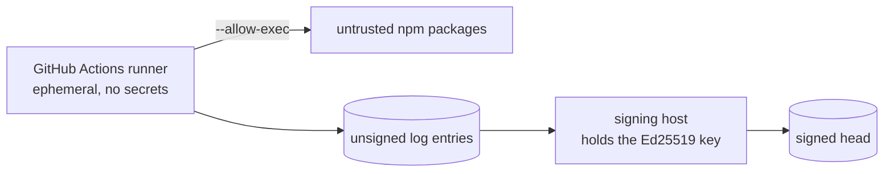

# Operating the crawler

The crawler touches other people's infrastructure. This page is about doing that without being a nuisance, and without getting the project blocked.

## The rules this crawler follows

1. **Identify yourself.** Every request carries `mcp-pin-crawler/0.1` and a link back to the repository. Anyone wondering who is calling can find out in one search.
2. **One `tools/list` per server per day.** This is a daily record, not real-time monitoring: a change can sit unrecorded for up to 24 hours.
3. **Never call a tool.** The crawler calls `initialize` and `tools/list`. It never invokes a tool, never sends arguments, never causes a side effect on anyone's system.
4. **Never authenticate.** When a server demands credentials, the crawler retries exactly once with an obvious placeholder value so the server will reach the point of listing tools. If it still refuses, the server is recorded as unindexable and left alone. No real credential is ever supplied, and no authentication is attempted or bypassed.
5. **Back off on failure.** A server that errors is not hammered. The failure reason is recorded and the next attempt is the next daily run.
6. **Honour opt out immediately, without asking why.** See below.

## Opt out

Add the server or package name to `OPTOUT.txt`, one per line, or open an issue titled `opt out: <name>`.

It is honoured on the next crawl. No justification is requested and none is required. Existing history for that server is removed from the site on request as well. The log itself is append only, so the honest thing is to state that clearly: entries already written stay in the file, but the server stops being probed and its pages come down.

## The placeholder credential question

This deserves a direct answer because it looks worse than it is.

Many MCP servers exit immediately if an expected environment variable is unset, before they ever list tools. The crawler reads the variable name the server itself printed to stderr and retries once with the literal string `mcp-pin-probe-placeholder`.

This is not a bypass. It does not authenticate, it does not grant access, and any server that actually validates the value will reject it. It exists so that servers which merely check for *presence* at startup can reach `tools/list`. If you consider even that intrusive for your server, opt out and it stops.

## Running a crawl

```bash
npm run crawl -- --limit 25            # HTTP servers only, executes nothing
npm run crawl -- --allow-exec          # also probes stdio servers
```

Useful flags:

| Flag | Default | Purpose |
|---|---|---|
| `--limit N` | all | Cap the number of servers |
| `--concurrency N` | 8 | Parallel probes. Keep at 2 or 3, npm's cache is not safe under heavy parallel installs |
| `--delay-ms N` | 250 | Stagger between probes |
| `--allow-exec` | off | Enable stdio probing. Sandbox required |
| `--data DIR` | `data` | Log and state location |

## Where to run it

**Never on a laptop with `--allow-exec`.** The correct home is a disposable CI runner.



The runner that executes untrusted code and the host that holds the signing key are deliberately separate. A compromised runner can poison a crawl. It cannot forge a signature.

## Yield expectations

Roughly 38% of npm discovered candidates produce a toolset. This is expected, not a bug:

- A third of `mcp` keyworded packages are SDKs, transports, or CLIs rather than servers
- Many real servers authenticate before listing tools
- Some fail to install at all

Failure reasons are recorded per server in `data/state.json` and are worth reading. They are the most honest description of the MCP ecosystem's actual shape that this project produces.

## Key management

The Ed25519 private key lives in `data/log-key.json`, mode 0600, and is gitignored.

- Generate once, back it up offline
- Publish the public key in the repository so anyone can verify heads
- Rotate by publishing both keys and a signed statement of the change, and never by quietly swapping them
- If it leaks, say so publicly and immediately. A transparency log that hides a key compromise has failed at the one thing it exists to do
