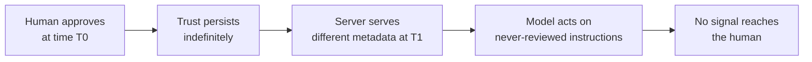
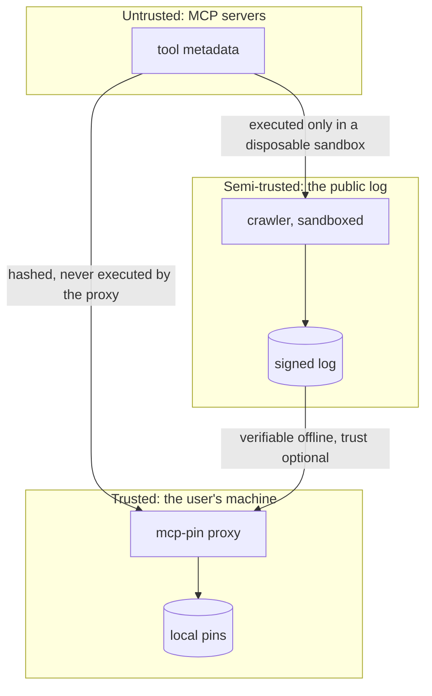

# Threat model

Last reviewed: 2 September 2026.

This document states what mcp-pin defends against, what it explicitly does not, and what an attacker who targets mcp-pin itself could try. It is mapped to the [OWASP Top 10 for LLM Applications 2026](https://owasp.org/www-project-top-10-for-large-language-model-applications/) (published 4 August 2026), the [OWASP Top 10 for Agentic Applications 2026](https://genai.owasp.org/) (ASI01 to ASI10), and STRIDE.

---

## 1. The problem being addressed

MCP blends instructions and data. A tool description is read by the model as guidance about what to do, so whoever controls the description holds influence comparable to a system prompt. Clients gate this with a one time human approval, and the protocol requires no integrity check on subsequent connects.

The result is a trust decision made once, against content that can change afterwards.

### Where this sits in the OWASP taxonomies

| Identifier | Category | Relationship |
|---|---|---|
| LLM01:2026 | Prompt Injection | Tool description poisoning is injection delivered through metadata rather than conversation. |
| LLM04:2026 | Supply Chain | An approved server mutating post approval is a supply chain compromise of the tool layer. |
| LLM07:2026 | Hidden Context Exposure | Tool schemas are explicitly named as hidden context that must not be the sole security control. |
| ASI02 | Tool Misuse and Exploitation | Legitimate tools bent toward destructive outputs via altered definitions. |
| ASI04 | Agentic Supply Chain Vulnerabilities | OWASP cites dynamic MCP ecosystems as the canonical example of runtime component poisoning. |
| ASI09 | Human Agent Trust Exploitation | Exploits the human's belief that approval was durable. |

OWASP's stated direction for 2026 is containment over prevention. mcp-pin is a containment control. It assumes the model will eventually be fooled and asks a narrower question: did the thing you approved change.

---

## 2. What mcp-pin defends

| Threat | Control | Residual risk |
|---|---|---|
| Rug pull after approval | Pin at approval, re-hash every connect, block on any difference | The user can approve a malicious diff |
| Silent tool addition | Set hash covers additions and removals | None for stdio |
| Schema widening to add an exfiltration parameter | Full input schema is fingerprinted | None |
| Annotation tampering (readOnlyHint flipped) | Annotations are in scope | None |
| Post hoc denial that a definition ever changed | Public hash linked, signed log | Only for servers the crawler can reach |

## 3. What mcp-pin does not defend

Stated plainly, because the gap matters more than the coverage.

- **Day one malice.** A server hostile from its first connect that never changes is indistinguishable from an honest stable server. Fingerprinting proves consistency, never intent.
- **Prompt injection through tool results.** Only metadata is fingerprinted. Content returned by a tool call is out of scope.
- **A compromised MCP client.** If the client is malicious, a proxy in front of the server is irrelevant.
- **Runtime behaviour.** A tool whose description is honest and whose implementation is not will pass every check.
- **Servers behind authentication.** They cannot be indexed publicly, so the log has a coverage hole that correlates with the servers holding the most sensitive access.

## 4. Attacks against mcp-pin itself

### 4.1 The crawler executes untrusted code

Probing a stdio server means downloading and running a third party npm package. This is the highest severity surface in the project and it maps to **ASI05, Unexpected Code Execution**.

| Control | Implementation |
|---|---|
| Not on by default | `--allow-exec` is required; without it only HTTP servers are probed |
| No lifecycle scripts | `npm install --ignore-scripts` |
| Minimal environment | The child inherits `PATH`, `HOME`, `NODE_ENV`, `CI` and nothing else. No tokens, no cloud credentials |
| Disposable host | CI only, on an ephemeral runner, with a read only `GITHUB_TOKEN` |
| Time bounded | Install and probe timeouts, `SIGKILL` on expiry |
| Output bounded | stdout byte cap, so a server cannot flood the crawler |

The signing key for the public log is **never present on a machine that runs `--allow-exec`**. If the crawler is compromised, the attacker can poison a crawl. They cannot sign a head.

### 4.2 Server Side Request Forgery through a hostile HTTP endpoint

A registry entry can point the crawler at an internal address. Mapped to **STRIDE Elevation of Privilege**.

Controls in `crawler/security.js`:

- Only `http:` and `https:` schemes
- DNS resolution checked before every request, including after every redirect
- Rejects loopback, RFC1918, link local (which covers `169.254.169.254`, the cloud metadata address), CGNAT, multicast, IPv6 ULA and loopback
- Credentials in URLs rejected
- Redirects capped at three, each hop revalidated
- Response bodies streamed against a byte cap

### 4.3 Denial of service through hostile metadata

A server can return an enormous toolset. Mapped to **LLM10:2026 Unbounded Consumption**.

Limits are constants in `crawler/security.js`: 2000 tools per server, 256 KB per tool, 8 MB per toolset, 8 MB per HTTP response. An oversized toolset is **rejected, not truncated**, because a truncated record would be a false fingerprint, and a false fingerprint in a transparency log is worse than no record at all.

### 4.4 Stored cross site scripting through tool descriptions

Every value rendered on the site is attacker controlled. Mapped to **STRIDE Tampering**.

- All interpolated values pass through HTML escaping covering `& < > " '`
- A restrictive Content Security Policy with `default-src 'none'`, `base-uri 'none'`, `form-action 'none'`, `frame-ancestors 'none'`
- `Referrer-Policy: no-referrer`
- Filenames derive only from validated hex identifiers, never from server supplied names

### 4.5 Log tampering by the operator

The threat that a transparency log exists to answer: what if the people running it edit history. Mapped to **STRIDE Repudiation**.

Every entry commits to its predecessor's hash, and heads are Ed25519 signed. Anyone can download the log and run `mcp-pin verify-log`. Because the log is committed to a public git repository on every crawl, the commit history is a second, independent record. An operator who rewrote an entry would need to rewrite git history in a repository other people have cloned.

**The honest limit:** a single operator signs today. This is not yet a multi witness log in the Certificate Transparency sense. Until independent witnesses co-sign heads, split view attacks (serving different histories to different people) are detectable only by clients who compare heads with each other.

### 4.6 Supply chain attack on mcp-pin itself

The obvious irony, and it is taken seriously.

- Zero runtime dependencies. Nothing to compromise transitively
- Node standard library only
- The published npm package ships `bin`, `src`, `crawler`, `site`, and the README, and nothing else
- Every release is tagged in git, and the tag is the reviewable artifact

---

## 5. Trust boundaries

The proxy never executes anything a server sends. It hashes bytes. The crawler does execute untrusted code, which is why it is confined to CI and holds no signing key.

## 6. Assumptions

1. SHA-256 remains collision resistant for this purpose.
2. RFC 8785 canonicalization is deterministic across implementations for the JSON subset that appears in MCP tool metadata.
3. The user's operating system, Node runtime, and MCP client are not already compromised.
4. Users read diffs before approving them. This is a real weakness. It is the same weakness every certificate warning has, and no cryptographic control fixes it.

## 7. Reporting

Vulnerabilities go to the process in [SECURITY.md](../SECURITY.md). Please do not open a public issue first.
