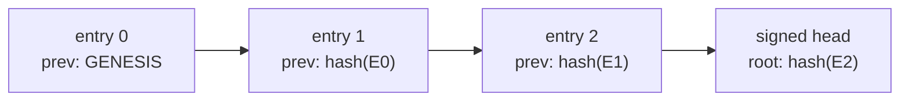

# Verifying the log without trusting us

A transparency log is only worth something if you can check it yourself. This page shows how, and is deliberately short enough to actually follow.

## The one command

```bash
curl -O https://mcp-pin.gautamkhosla.com/log.ndjson
curl -O https://mcp-pin.gautamkhosla.com/head.json
curl -O https://mcp-pin.gautamkhosla.com/PUBLIC_KEY.txt
npx --yes mcp-pin@0.1.1 verify-log .
```

```
public log OK, 4812 entries, chain intact, head signature valid
```

Non zero exit means something is wrong and you should say so publicly.

## What that command actually checks



1. **Chain integrity.** Each entry names its predecessor's hash. Editing entry 4 changes its hash, so entry 5's `prev_entry_hash` no longer matches, and so on to the end.
2. **Entry integrity.** Each entry's `entry_hash` is SHA-256 over its own canonicalized content. Changing any field breaks it.
3. **Head signature.** The head is Ed25519 signed. The verifier pins `PUBLIC_KEY.txt` from the package (and from the site root). It will not accept a head signed by whatever key arrives with the file. A missing head, a mismatched `tree_size`, and a malformed log all fail.

Together: you cannot change history without either breaking the chain or forging a signature.

## Doing it by hand

If you would rather not trust our verifier either, that is the correct instinct.

```bash
# recompute one entry's hash
node -e '
const crypto = require("crypto");
const line = require("fs").readFileSync("log.ndjson","utf8").split("\n")[0];
const e = JSON.parse(line);
const claimed = e.entry_hash;
delete e.entry_hash;
const sorted = (o) => Array.isArray(o) ? o.map(sorted)
  : (o && typeof o === "object")
    ? Object.keys(o).sort().reduce((a,k)=>(a[k]=sorted(o[k]),a),{})
    : o;
const actual = crypto.createHash("sha256").update(JSON.stringify(sorted(e))).digest("hex");
console.log(claimed === actual ? "entry 0 verifies" : "MISMATCH");
'
```

```bash
# verify the head signature
node -e '
const crypto = require("crypto"), fs = require("fs");
const h = JSON.parse(fs.readFileSync("head.json","utf8"));
const { signature, public_key, ...body } = h;
const key = crypto.createPublicKey({ key: Buffer.from(public_key,"base64"), format:"der", type:"spki" });
const sorted = (o) => Array.isArray(o) ? o.map(sorted)
  : (o && typeof o === "object")
    ? Object.keys(o).sort().reduce((a,k)=>(a[k]=sorted(o[k]),a),{})
    : o;
console.log(crypto.verify(null, Buffer.from(JSON.stringify(sorted(body))), key,
  Buffer.from(signature,"base64")) ? "head signature valid" : "INVALID");
'
```

## The second, independent record

Every crawl commits the log to a public git repository. That commit history is a separate append only record maintained by GitHub rather than by this project. Rewriting a log entry would require rewriting git history that other people have already cloned.

Keeping your own copy is the strongest thing you can do. If your copy and the published copy ever disagree, you can prove it.

## What verification does not prove

Being precise here matters more than sounding strong.

- It proves **nobody edited the record**. It does not prove the record is complete. A crawl that never reached a server records nothing about it.
- It does not prove any server is safe. It proves what its definitions were, and when.
- **Split view is not yet ruled out.** A single operator signs today. Certificate Transparency solves this with independent witnesses co-signing heads, and this project has not built that yet. Until it does, comparing your head against someone else's is the practical defence, and it works.
